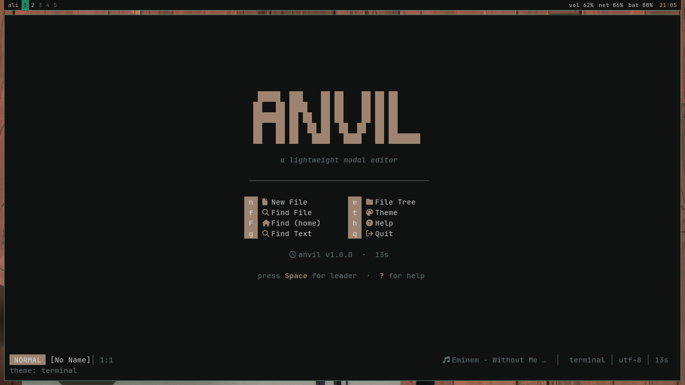
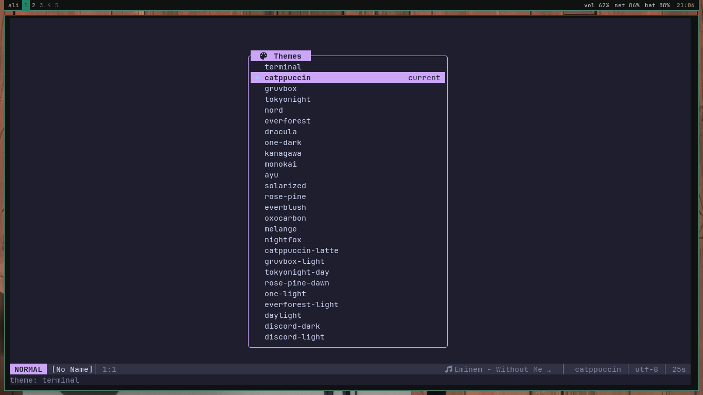
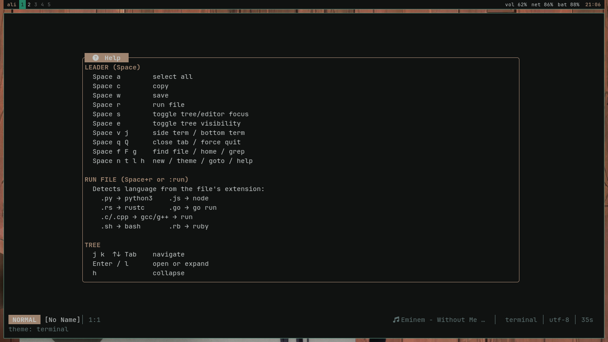
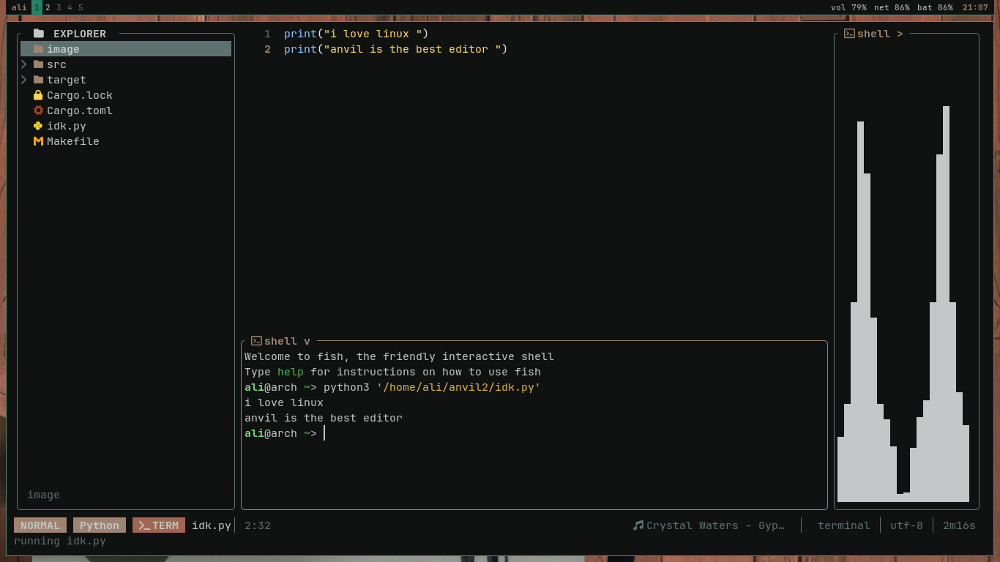
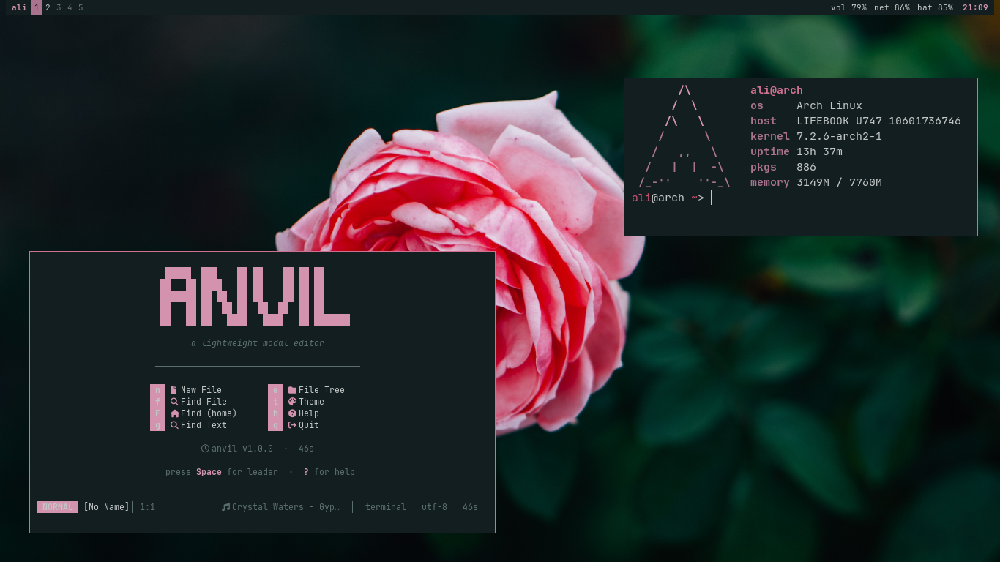

<div align="center">

# ⚡ anvil

**A lightweight, fast, and beautiful modal text editor for the terminal.**

*Built in Rust · Inspired by Neovim · Designed for humans.*

[](https://www.rust-lang.org/)
[](LICENSE)
[](#installation)
[](https://discord.gg/cXTG5Z72yT)

[Features](#-features) · [Installation](#-installation) · [Usage](#-usage) · [Keybindings](#%EF%B8%8F-keybindings) · [Configuration](#%EF%B8%8F-configuration) · [Community](#-community)

</div>

---

## 📸 Screenshots

<div align="center">

### 🏠 Dashboard


### 🎨 Theme Picker


### 📖 Help Window


### 💻 Editor + File Tree + Integrated Terminals


### 🪟 Transparent Background


</div>

---

## ✨ Features

**anvil** is a modal editor that feels like Neovim but looks and behaves like a modern IDE — all inside your terminal.

| | Feature |
|---|---|
| 🎨 | **26 built-in themes** — Catppuccin, Gruvbox, TokyoNight, Nord, Dracula, and more |
| 🔍 | **Fuzzy finder** — open files and grep through your project in milliseconds |
| 💻 | **Integrated terminal** — split horizontally or vertically, powered by real PTY |
| 🌳 | **File tree** — VSCode-style explorer with breadcrumbs and history navigation |
| 🚀 | **Run files instantly** — `Space + r` executes the current file in any language |
| 🔬 | **Live diagnostics** — catches unterminated strings *and* common typos (`prraint` → *did you mean `print`?*) |
| 🎯 | **Smart completion** — inline autocomplete across all languages |
| 🌍 | **Unicode & Arabic support** — works with RTL and multi-byte characters |
| 🖱️ | **Full mouse support** — click, drag, scroll, right-click everywhere |
| ⚡ | **Blazing fast** — Rust + Ratatui, renders at 60fps with low CPU |
| 🎵 | **Now Playing** — shows your current music track in the status bar |
| 🎛️ | **Hot config reload** — edit `config.ini`, changes apply instantly |

---

## 🧠 The Idea

Most terminal editors are either **too minimal** (nano) or **too complex** (Vim from scratch). **anvil** sits in the sweet spot:

- **Modal editing** like Vim — muscle memory that never leaves you
- **Modern UX** like VSCode — tree, finder, theme picker, mouse support
- **Zero config** to start — but fully customizable when you want
- **Single binary** — no runtime, no Node, no Python

The name comes from a blacksmith's anvil: a solid, reliable tool you shape things on.

---

## 📦 Installation

### Step 1 — Install Rust

anvil is written in Rust, so you need the Rust toolchain first.

**Linux / macOS / WSL:**

```bash
curl --proto '=https' --tlsv1.2 -sSf https://sh.rustup.rs | sh
```

Then reload your shell or run:

```bash
source "$HOME/.cargo/env"
```

Verify the installation:

```bash
cargo --version
# cargo 1.75.0 (or newer)
```

> **Arch Linux users:** you can also install Rust via `sudo pacman -S rust` — but `rustup` is recommended for version flexibility.

### Step 2 — Clone the repository

```bash
git clone https://github.com/your-username/anvil.git
cd anvil
```

### Step 3 — Build the release binary

```bash
cargo build --release
```

This compiles the optimized binary to `target/release/anvil`. It takes 1–2 minutes on the first build.

### Step 4 — Install system-wide

```bash
sudo make install
```

This copies `target/release/anvil` to `/usr/local/bin/anvil`, which is already in your `PATH`.

> **No `sudo`?** You can install to your user directory instead:
> ```bash
> PREFIX=$HOME/.local make install
> ```
> Then make sure `~/.local/bin` is in your `PATH`.

### Step 5 — Verify

```bash
which anvil
# /usr/local/bin/anvil

anvil
```

You should see the **anvil dashboard** with the logo and menu.

### Quick test

```bash
anvil                    # open dashboard
anvil path/to/file.py    # open a file
anvil .                  # open current directory
```

### Uninstall

```bash
sudo make uninstall
```

### Prerequisites checklist

- ✅ **Rust 1.75+** (installed via `rustup`)
- ✅ A modern terminal: **Kitty**, **WezTerm**, **Alacritty**, **foot**, or **GNOME Terminal**
- ✅ **A Nerd Font** for icons — recommended: [JetBrainsMono Nerd Font](https://www.nerdfonts.com/)

---

## 🚀 Usage

### First launch

Run `anvil` with no arguments and you'll see the **dashboard** — a menu of quick actions:

- `n` → new file
- `f` → find file
- `g` → live grep
- `e` → file tree
- `t` → theme picker
- `h` → help
- `q` → quit

### Modal editing

anvil uses **modes**, like Vim:

| Mode | What it does |
|------|--------------|
| `NORMAL` | Navigate, run commands, press `i` to type |
| `INSERT` | Type text, press `Esc` to go back |
| `VISUAL` | Select text with `v` or `V` |
| `COMMAND` | Press `:` for commands, `/` to search |

### The Leader key

Press **`Space`** in NORMAL mode to open the **leader menu** — a floating panel with every action at your fingertips.

---

## ⌨️ Keybindings

### Leader (press `Space` first)

| Key | Action |
|-----|--------|
| `Space` `a` | Select all |
| `Space` `c` | Copy line / selection |
| `Space` `w` | Save file |
| `Space` `r` | **Run current file** |
| `Space` `s` | Toggle tree ↔ editor focus |
| `Space` `e` | Toggle file tree |
| `Space` `v` | Side terminal |
| `Space` `j` | Bottom terminal |
| `Space` `f` | Find file (fuzzy) |
| `Space` `F` | Find file from `$HOME` |
| `Space` `g` | Live grep |
| `Space` `l` | Goto line |
| `Space` `n` | New file |
| `Space` `t` | Theme picker |
| `Space` `h` | Help |
| `Space` `q` | Close current tab |
| `Space` `Q` | Force quit |

### Navigation (NORMAL mode)

| Key | Action |
|-----|--------|
| `h` `j` `k` `l` | Move left / down / up / right |
| `w` `b` `e` | Next word / previous word / end of word |
| `0` `^` `$` | Line start / first non-blank / line end |
| `gg` / `G` | File start / file end |
| `{` `}` | Jump between paragraphs |
| `%` | Match bracket |

### Editing

| Key | Action |
|-----|--------|
| `i` `a` `I` `A` | Insert (before / after / line start / line end) |
| `o` `O` | New line below / above |
| `x` | Delete character |
| `dd` `yy` | Delete / yank line |
| `dw` `yw` | Delete / yank word |
| `p` `P` | Paste after / before |
| `u` / `Ctrl+r` | Undo / Redo |
| `>` `<` | Indent / outdent |
| `v` `V` | Visual / visual line mode |

### Search & Command

| Key | Action |
|-----|--------|
| `/text` | Search forward |
| `n` `N` | Next / previous match |
| `*` `#` | Search word under cursor |
| `:` | Command mode (`:w`, `:q`, `:wq`, `:run`, `:theme`, …) |

### File tree

| Key | Action |
|-----|--------|
| `j` `k` | Navigate |
| `Enter` / `l` | Open file or toggle folder |
| `h` | Collapse folder |
| `a` / `f` | New file / folder |
| `d` | Delete |
| `Backspace` | Go back (history) |
| `-` | Go up to parent |
| `H` | Go home |
| `R` | Refresh |

### Global

| Key | Action |
|-----|--------|
| `Ctrl+w` then `h/j/k/l` | Move between panes |
| `Ctrl+v` | Paste (works in terminals too) |
| `Tab` / `Shift+Tab` | Next / previous tab |
| `Esc` | Cancel / exit current mode |

---

## ⚙️ Configuration

anvil stores its config at `~/.config/anvil/config.ini`. It's created automatically on first run and **hot-reloaded** within 500ms of editing.

```ini
; ─── general ─────────────────────────────────────
version            = 9
theme              = catppuccin
mouse              = true
music_enabled      = true

; ─── file tree ───────────────────────────────────
tree               = true
tree_width         = 34
tree_follow        = true

; ─── terminals ───────────────────────────────────
term_side_width    = 44
term_bottom_height = 12

; ─── custom keybinds ─────────────────────────────
; actions: term, term:<dir>, sterm, sterm:<dir>,
;          run:<cmd>, edit:<path>, cd:<dir>, new, save
key.ctrl+t = term
key.ctrl+p = edit:~/projects

; ─── color overrides ─────────────────────────────
color.accent   = #ff79c6
color.tree_dir = #50fa7b

; ─── logo & menu ─────────────────────────────────
[logo]
 █████  ███    ██ ██    ██ ██ ██
██   ██ ████   ██ ██    ██ ██ ██
███████ ██ ██  ██ ██    ██ ██ ██
██   ██ ██  ██ ██  ██  ██  ██ ██
██   ██ ██   ████   ████   ██ ███████
[/logo]

menu = n |  | New File
menu = f |  | Find File
menu = g |  | Find Text
menu = e |  | File Tree
menu = t |  | Theme
menu = q |  | Quit
```

### Available themes

`terminal` · `catppuccin` · `gruvbox` · `tokyonight` · `nord` · `everforest` · `dracula` · `one-dark` · `kanagawa` · `monokai` · `ayu` · `solarized` · `rose-pine` · `everblush` · `oxocarbon` · `melange` · `nightfox` · `catppuccin-latte` · `gruvbox-light` · `tokyonight-day` · `rose-pine-dawn` · `one-light` · `everforest-light` · `daylight` · `discord-dark` · `discord-light`

Press `Space + t` and pick with the arrow keys. Enter saves; double-click selects.

---

## 🗂️ Project Structure

```
anvil/
├── src/
│   ├── main.rs        # entry point, terminal setup, event loop
│   ├── app.rs         # core state, mode machine, input handling
│   ├── ui.rs          # rendering (editor, tree, popups, status)
│   ├── buffer.rs      # text buffer, undo/redo, cursor
│   ├── config.rs      # config loading, themes, save/reload
│   ├── tree.rs        # file tree with history
│   ├── finder.rs      # fuzzy file search + live grep
│   ├── syntax.rs      # syntax highlighting + diagnostics
│   └── terminal.rs    # PTY-backed embedded terminal
├── image/             # screenshots for README
├── Cargo.toml
├── Makefile
└── README.md
```

---

## 🤝 Contributing

Contributions are welcome! Whether it's a bug fix, a new feature, or a theme:

1. **Fork** the repo
2. **Create a branch** (`git checkout -b feat/my-feature`)
3. **Commit** your changes (`git commit -m 'feat: add x'`)
4. **Push** (`git push origin feat/my-feature`)
5. **Open a Pull Request**

### Ideas for contributors

- 🌐 More syntax languages
- 🎯 LSP integration
- 🎬 Macro recording
- 🖥️ Split views
- 🧪 Unit tests for `buffer.rs`

---

## 💬 Community

Join the **Arab FOSS** Discord — a community for Arabic open-source developers:

<div align="center">

### 👉 [discord.gg/cXTG5Z72yT](https://discord.gg/cXTG5Z72yT) 👈

*Ask questions, share your setup, suggest features, or just hang out.*

</div>

---

## 📜 License

MIT — see [LICENSE](LICENSE) for details.

---

<div align="center">

**Made with ❤️ in Rust**

If you like anvil, consider giving it a ⭐ on GitHub!

</div>